# RunTime Data Confidentiality
Data Confidentiality Rules used to anonymous the data to prevent the identification of any dataset instances and keep all data confidential

It is important to apply any Confidentiality Rules in a specific Order or one rule could override another Rule and you will take a very long time to debug, and the solution will be as easy as switch two line of codes. 
and this is why this Code gurantee the execution order of all confidentiality Rules because it is a runtime configuration.

This Code is a runtime configuration tool uses 9 Categories to control data visiability

1- See only specific columns by name 

2- See only specific columns by col index 

3- all column types must be converted into strings ( in read mode you do not need any data type other than string data type).

4- Column visability based on another column cell.

5- Hise Full column for all table rows ( for all instances)

6- Hide specific value in a specific columns.

7- hide any vlaue in a column except a selected values will be visiable to users.

8- hide column cell/value based on another column value which does not need to be for the same instance.

9- if you have different datasets but they uses the same column names and order this configuration can be applied/triggered on both datasets for the same configured users.

10- hide cell or column be a defiened mask pattern 

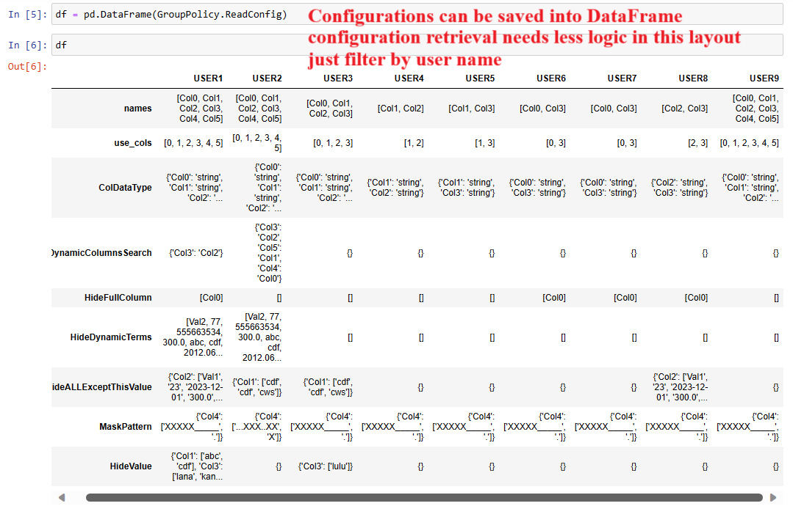
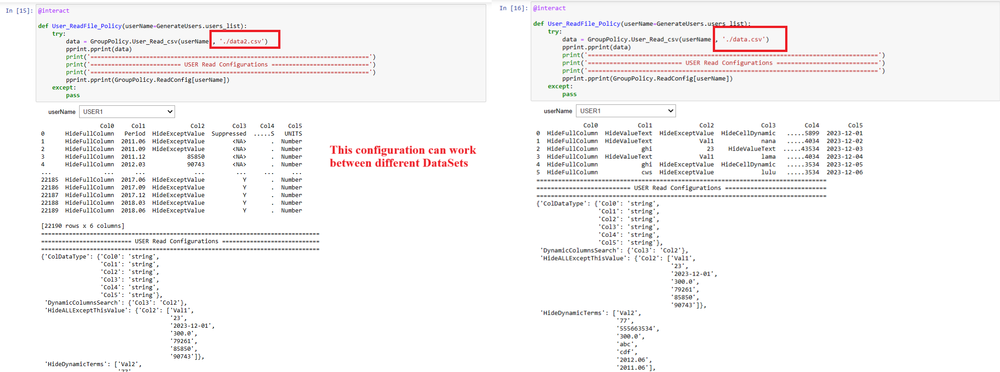
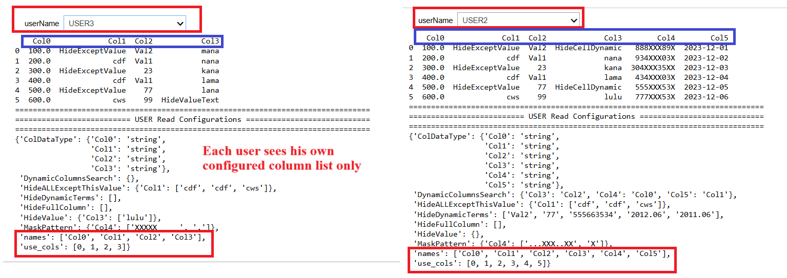
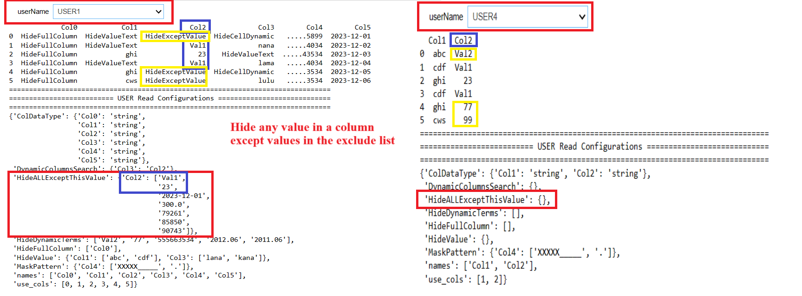
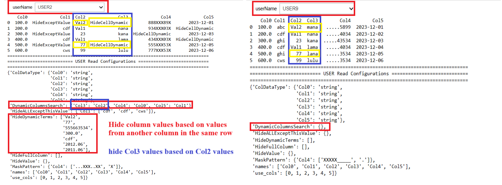
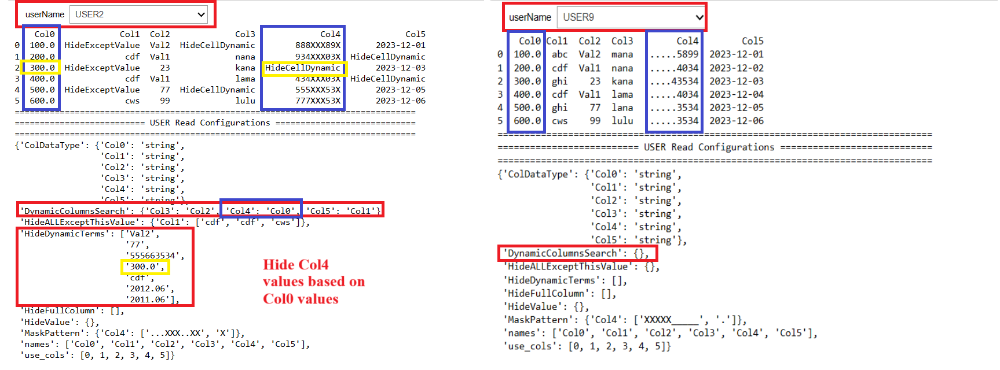
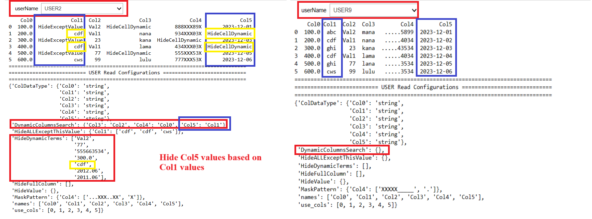
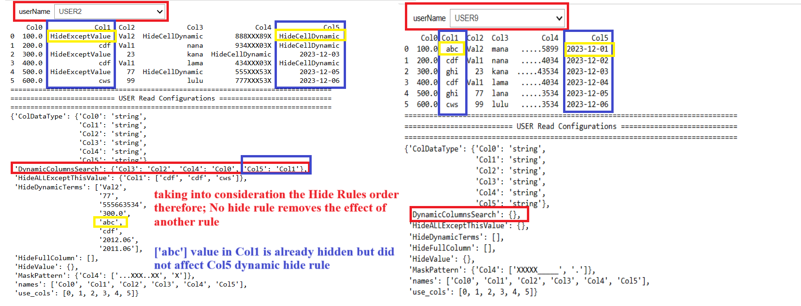
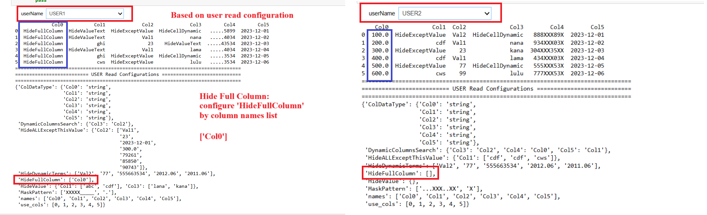
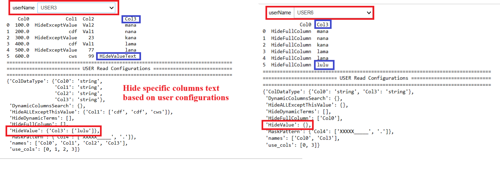
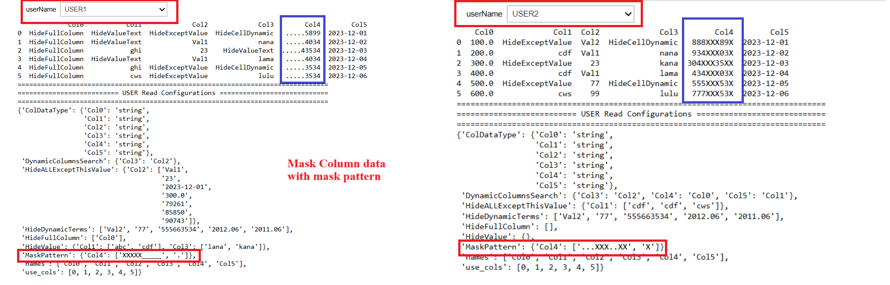

